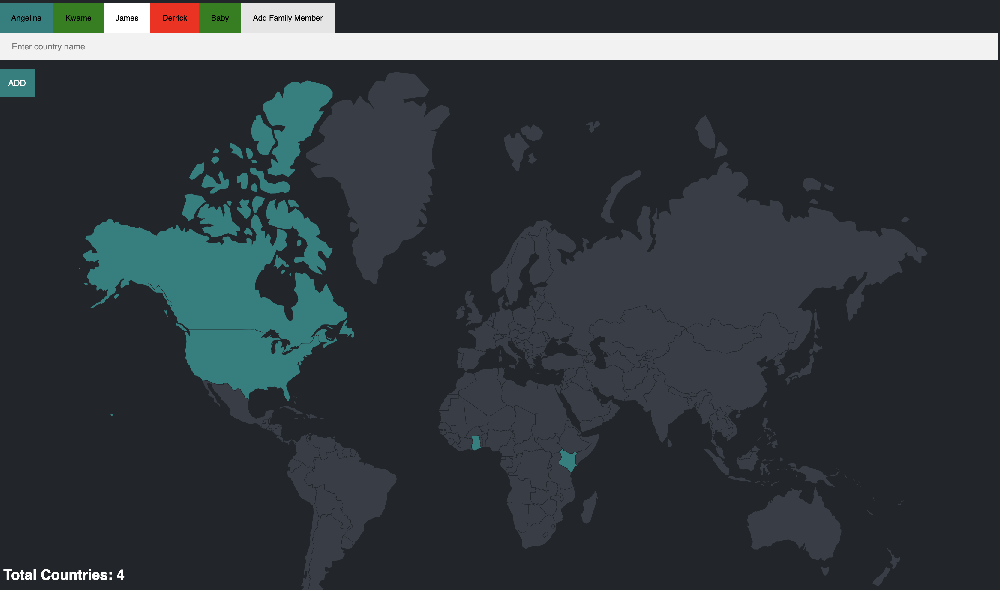

# Visited Countries Tracker

This project is a web application built with Express.js that allows users to track their visited countries. Users can add new countries they have visited, view the list of visited countries, and switch between different users to view their respective visited countries.



## Features

- **Add Visited Countries:** Users can input the name of a country they have visited, and the application will add it to their list of visited countries.
- **View Visited Countries:** The application displays the list of visited countries for the currently selected user.
- **Switch Users:** Users can switch between different users to view and manage their respective visited countries.
- **Dynamic Color Theme:** Each user has a unique color theme associated with their profile, making the application visually appealing and easy to navigate.

## Technologies Used

- **Express.js:** A web application framework for Node.js used to handle routing and server-side logic.
- **Body-Parser:** Middleware for parsing incoming request bodies, essential for handling form data.
- **PostgreSQL:** A powerful, open-source relational database used to store user information and visited countries data.
- **ejs:** Embedded JavaScript templating engine used for rendering dynamic HTML pages with data from the server.

## Prerequisites

Before running the application, make sure you have the following installed:

- [Node.js](https://nodejs.org/)
- [npm](https://www.npmjs.com/) (Node.js package manager)
- PostgreSQL installed and running on your machine

## Installation

1. Clone the repository:

   ```bash
   git clone https://github.com/nanaagyei/traveltracker.git
   ```

2. Navigate to the project directory:

   ```bash
   cd your_repository
   ```

3. Install dependencies:

   ```bash
   npm install
   ```

4. Set up PostgreSQL database:

   - Create a new database named `world`.
   - Run the SQL script `schema.sql` in the repository to create the necessary tables.

5. Configure database connection:

   - Open `index.js` and update the database configuration details (`user`, `host`, `password`, `port`) to match your PostgreSQL database settings.

## Usage

1. Start the server:

   ```bash
   npm start
   ```

2. Open your web browser and navigate to `http://localhost:3000` to access the application.

3. Use the application to add visited countries, view the list of visited countries, and switch between different users.

## Acknowledgments

This project is inspired by the need for a simple and efficient way to track visited countries and is provided for educational purposes.

## License

This project is licensed under the [MIT License](LICENSE).

---

Feel free to contribute to this project by submitting bug reports, feature requests, or pull requests. If you encounter any issues or have suggestions for improvements, please feel free to open an issue. Thank you for using our Visited Countries Tracker! 🌍
